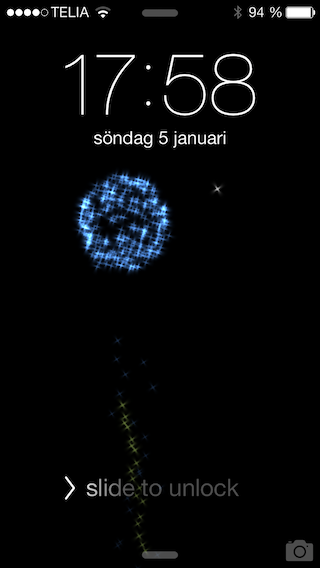
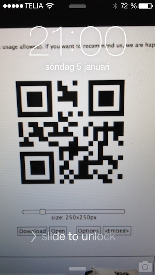

ProceduralWallpaper
===================

Procedural wallpapers are the dynamic, animated wallpapers for iOS 7.
This sample code contains two different wallpapers. One that displays fireworks, and the other the output from the camera (with an optional, automatic QR-reader).

Development
-----------

A procedural wallpaper on iOS 7 consists of an instance conforming to the SBFProceduralWallpaper protocol, and a UIView to be presented on screen (they can be the same).

The required methods are:

+ `+identifier`
+ `+colorChangesSignificantly`
+ `+presetWallpaperOptions`
+ `-setWallpaperOptions:`
+ `-setWallpaperVariant:`
+ `-view` (if you subclass SBFProceduralWallpaper, it returns itself for you)
+ `-delegate` and `-setDelegate:`

All classes available in a bundle are specified in an array with the key `SBProceduralWallpaperClassNames` in the bundle's Info.plist file.

+presetWallpaperOptions and -setWallpaperOptions:
--------------------------------------------------

`+presetWallpaperOptions` should return an array of dictionaries, each representing one variant of the wallpaper. Each dictionary must, at least, contain an image name for the key `kSBUIMagicWallpaperThumbnailNameKey`.

`-setWallpaperOptions:` will be called after the procedural wallpaper has been created, and will contain the selected option dictionary from the `+presetWallpaperOptions` array.

Compiling and installing
------------------------

You need to have a jailbroken iPhone to install and run this wallpaper. The bundle should be copied to /System/Library/ProceduralWallpapers and can then be selected from the wallpaper settings sections in Settings.app. Changes require SpringBoard to be restarted using `killall SpringBoard`.
